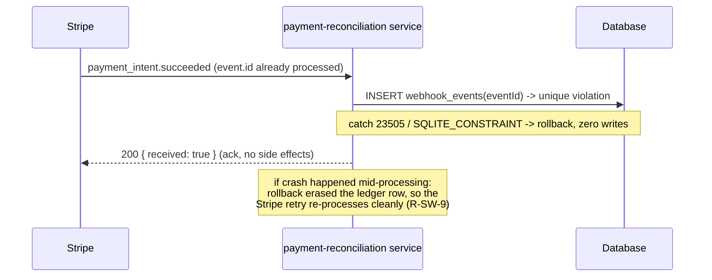
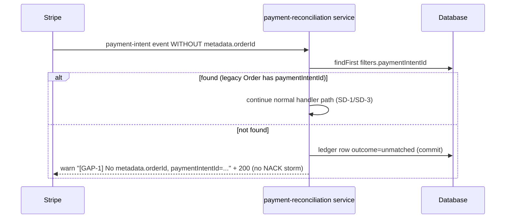

# Design: Sprint 5 — Gap #1: Stripe webhooks for payment intents

## 1. Architecture Overview

The webhook handler becomes the single server-side authority for payment outcomes. A new reconciliation service handles `payment_intent.succeeded` / `payment_intent.payment_failed` inside one `strapi.db.transaction` per event: the `webhook_events` ledger row is inserted first (idempotency), then correlation (unique `orderId` → unique `paymentIntentId`), then the Order write (transition or D+ shell via Document Service), then an exactly-once, CAS-guarded atomic stock decrement. Side-effect emails move to post-commit callbacks. The `afterCreate` lifecycle stock decrement is removed; restoration is gated by a new persisted `stockDeducted` marker so `payment_failed` paths never restore un-deducted stock. `charge.refunded` stays on Entity Service, unchanged.

**Added**: `payment-reconciliation` service, `webhook-event` content type (ledger), `stockDeducted` Order flag, `payment_failed` status, retention cron, env kill-switch.
**Modified**: `stripe-webhook.ts` (dispatch), `lifecycles.ts` (decrement removed, email/status gating), `order.ts` service (atomic stock), Order + history schemas, `order.types.ts` matrix.
**Unchanged**: controller 400/500 mapping, custom routes, `charge.refunded` behavior, the 5 existing tests (verified — §6).

## 2. Sequence Diagrams

### SD-1 — `payment_intent.succeeded`, client-first (pending Order exists)

```mermaid
sequenceDiagram
    participant FE as Frontend
    participant ST as Stripe
    participant WH as stripe-webhook service
    participant RC as payment-reconciliation service
    participant LC as Order lifecycles
    participant DB as Database

    FE->>ST: PaymentIntent created (metadata.orderId, userId)
    FE->>DB: POST /api/orders (status pending, items)
    Note over LC,DB: afterCreate: history null->pending.<br/>NO stock decrement, NO email (not paid)
    ST->>WH: payment_intent.succeeded
    WH->>WH: constructEvent (verify signature)
    WH->>RC: handleSucceeded(event)
    activate RC
    Note over RC: open strapi.db.transaction ({ trx, onCommit })
    RC->>DB: INSERT webhook_events(eventId)  [ledger before processing]
    RC->>DB: documents.findFirst filters.orderId -> pending Order
    RC->>DB: documents.update(documentId, paid)
    DB->>LC: beforeUpdate validates pending->paid / afterUpdate
    LC->>DB: status history pending->paid
    LC->>RC: register email on webhook-context onCommit (no fetch inside trx)
    RC->>DB: decrementStockOnce: CAS orders SET stock_deducted=true<br/>WHERE stock_deducted=false; then UPDATE products<br/>SET stock=stock-q WHERE id=? AND stock>=q
    Note over RC: COMMIT (all atomic)
    deactivate RC
    WH-->>ST: 200 { received: true }
    RC-)FE: after commit: send-order-email (status paid)
```

### SD-2 — succeeded, orphan path (webhook-first, D+ shell)

```mermaid
sequenceDiagram
    participant FE as Frontend
    participant ST as Stripe
    participant RC as payment-reconciliation service
    participant LC as Order lifecycles
    participant DB as Database

    ST->>RC: payment_intent.succeeded (no matching Order yet)
    Note over RC: strapi.db.transaction; ledger INSERT first
    RC->>DB: findFirst by orderId -> none; by paymentIntentId -> none
    RC->>DB: documents.create shell: orderId, user connect userId,<br/>paymentIntentId, total (amount/100), status paid,<br/>items [], paymentInfo.source=webhook_reconciliation
    DB->>LC: beforeCreate keeps data.user (no ctx user);<br/>afterCreate: history null->paid; email gate (paid) fires; no decrement (items empty)
    RC->>DB: onCommit email -> COMMIT
    RC-->>ST: 200
    Note over FE: useCreateOrder arrives later (Gap #3 UPSERT)
    FE->>DB: UPSERT by orderId: items, subtotal, shipping
    DB->>LC: afterUpdate: status unchanged paid -> enrichment gate hits<br/>(paid && !stockDeducted && items>0)
    LC->>DB: decrementStockOnce (CAS + atomic product UPDATE)
    Note over LC,DB: early-return before history/email -> no duplicate email
```

### SD-3 — `payment_intent.payment_failed` with pending Order

```mermaid
sequenceDiagram
    participant ST as Stripe
    participant RC as payment-reconciliation service
    participant LC as Order lifecycles
    participant DB as Database

    ST->>RC: payment_intent.payment_failed (last_payment_error, failure_message)
    Note over RC: strapi.db.transaction; ledger INSERT first
    RC->>DB: findFirst by orderId -> pending Order
    RC->>DB: documents.update(documentId, payment_failed,<br/>paymentInfo.paymentError {code, failure_message} only)
    DB->>LC: beforeUpdate validates pending->payment_failed / afterUpdate
    LC->>DB: history pending->payment_failed
    Note over LC: stock NOT restored (stockDeducted=false);<br/>no shipment, no refund auto-trigger
    LC->>RC: onCommit email statusChangeNote 'Payment failed: ...'
    RC->>DB: COMMIT
    RC-->>ST: 200
```

### SD-4 — duplicate `event.id` re-delivery



### SD-5 — missing `metadata.orderId` fallback



## 3. Architecture Decisions

### D-DESIGN-1 — Transaction boundary

**Decision**: (a) `strapi.db.transaction(async ({ trx, onCommit }) => …)` wraps ledger insert + correlation + Order write + stock decrement + history for every succeeded/failed event.
**Rationale**: Strapi docs confirm all `entityService` / `db.query` (and thus Document Service, built on Query Engine) calls inside the handler implicitly join the transaction; nested transactions attach to the ambient one. This is the only option making R-SW-9 + R-OSA-5 atomic. No prior `db.transaction` usage exists in `src/` (verified); this cycle introduces it, following the Document Service convention of Engram #320. Network calls (email fetch) are deferred via an `AsyncLocalStorage` webhook context carrying `onCommit`, so row locks are never held across HTTP I/O.
**Alternatives**: (b) raw `knex.transaction` — Strapi service calls would not join it (ledger + Order writes not atomic) ✗; (c) no transaction — crash mid-way leaves partial state and a committed ledger row that blocks the Stripe retry, violating R-SW-9 ✗.
**Consequences**: every side effect must be DB-only inside the handler; email is at-most-once-after-commit (already best-effort today — `lifecycles.ts:99-101` swallows failures); processing throws → rollback → no ledger row → Stripe retry re-processes.

### D-DESIGN-2 — `updateProductStock` hardening

**Decision**: (d) single atomic relative UPDATE via knex inside the ambient trx: `UPDATE products SET stock = stock - ? WHERE id = ? AND stock >= ?` (affected-rows = 0 → insufficient stock); restoration uses `stock = stock + ?`. Signature becomes `updateProductStock(productId, quantityChange, opts?: { trx? })`, self-opening `strapi.db.transaction` when none is ambient (covers legacy `charge.refunded` restoration callers at `lifecycles.ts:307-323`). Table name resolved from content-type metadata (`products` — `schema.json:3`), never hardcoded.
**Rationale**: correct on both engines — PostgreSQL (dev/prod) row-locks per statement (50 concurrent decrements on one product serialize per-row, no lost updates, no long locks); SQLite in-memory (better-sqlite3, single connection) is inherently serialized. No schema migration, fully backward-compatible with existing callers.
**Alternatives**: (a) `SELECT … FOR UPDATE` — unsupported syntax on SQLite, dialect branch, wider lock window ✗; (b) compare-and-set retry loop — retry semantics inside an open trx are ambiguous ✗; (c) `stockVersion` column — Product migration + all writers must cooperate; exceeds gap scope ✗. The old `Math.max(0, …)` floor is replaced by the `stock >= q` guard; the decrement claim itself is a CAS on `orders.stock_deducted` (§D-DESIGN-5).
**Consequences**: the webhook decrement and the enrichment decrement share one idempotent helper `decrementStockOnce` (CAS marker + guarded SQL); `ApplicationError`-class stock failures at enrichment time follow S-OSA-6 (§D-DESIGN-5).

### D-DESIGN-3 — `webhook_events` content type

**Decision**: `api::webhook-event.webhook-event`, collection `webhook_events`:

| Field | Type | Serves |
|---|---|---|
| `eventId` | string, required, **unique** | R-SW-3 idempotency key (DB-enforced in Strapi 5) |
| `eventType` | string, required | ops triage / observability |
| `paymentIntentId` | string, optional | correlation audits |
| `orderId` | string, optional | correlation audits |
| `processedAt` | datetime, required | retention sweep |
| `outcome` | enum `processed` \| `unmatched`, required | see below |
| `errorMessage` | text, optional | non-fatal processing warnings |
| ~~`payload`~~ | **not stored** | Stripe retains ~21 days of event history; full payloads duplicate PII (customer, payment method refs) and bloat the JSON column. Correlation fields above suffice. |

`duplicate` is never persisted (the unique violation *is* the detection path); `failed` is never persisted (rollback erases the row; persisting it under a unique `eventId` would block legitimate re-processing, breaking R-SW-9).
**Indexes**: unique on `eventId` declaratively. Strapi 5 has no declarative secondary indexes; optional deploy migration adds `CREATE INDEX IF NOT EXISTS` on `processedAt` (retention DELETE) — volume ≈ events/day, negligible; `paymentIntentId` index skipped (cleanup queries are time-based).
**Retention**: 90 days (covers disputes/audit needs well beyond Stripe's 21-day window at this scale), enforced by a daily `strapi.cron` task in `config/cron-tasks.ts`.
**Permissions**: `src/api/webhook-event/routes/webhook-event.ts` exports `routes: []` → no public/authenticated REST; writes only from service code inside the trx; read-only visibility via the admin panel.
**Consequences**: one new content type + one cron file; ledger becomes the canonical webhook audit trail.

### D-DESIGN-4 — Document Service API mapping

**Decision** (new logic only; `charge.refunded` keeps Entity Service per locked Decision 11):

| Step | Call |
|---|---|
| Lookup by orderId (unique) | `strapi.documents('api::order.order').findFirst({ filters: { orderId } })` |
| Fallback by paymentIntentId (now unique) | `findFirst({ filters: { paymentIntentId } })` |
| Shell create | `documents.create({ data: { …, user: { connect: [userId] } } })` |
| Transition | `documents.update({ documentId: doc.documentId, data: { orderStatus, … } })` |
| Marker/flag writes | `strapi.db.query(...).update(...)` (lifecycle-free) |

**findFirst vs findMany**: `findFirst` returns one doc | null — correct when the filter is unique-backed; `findMany` returns arrays and reintroduces the `orders[0]` ambiguity flagged in exploration (`stripe-webhook.ts:67`). With Decision 5's unique `paymentIntentId`, both lookups are correct with `findFirst`.
**Lifecycles**: Document Service **does** trigger `beforeUpdate`/`afterUpdate` (and create hooks). Double side effects are prevented structurally: `afterCreate` no longer decrements; email is gated on `orderStatus === 'paid'` at create and on a real status change at update (`lifecycles.ts:284-287` early-return suppresses enrichment email); the decrement is CAS-idempotent.
**documentId vs numeric id**: every handler path carries the `documentId` from the lookup result into `update`; numeric `id` is only used by the legacy refund branch. Marker flips deliberately use `db.query`/raw trx so they never re-trigger lifecycles.
**Shell path**: NOT bypassed — shells go through normal `documents.create` (see D-DESIGN-6).

### D-DESIGN-5 — Lifecycle refactor specifics

**Decision**:
- **Remove** the decrement block `lifecycles.ts:174-185` (the `if (result.orderStatus !== 'cancelled' && …)` at :176 and the loop :179-184).
- **Keep** initial history `:167-172` unchanged — it correctly records `null → pending` (client) and `null → paid` (shell), so the webhook never calls `createStatusHistoryEntry` directly. (The orchestrator's suggested `'system@stripe-webhook'` author is rejected: `changedByEmail` is an `email`-typed field — `order-status-history/schema.json:45-46` — and lifecycle fallback `'system@example.com'` already applies.)
- **Re-gate** email: `afterCreate` fires `sendOrderEmailWebhook(…, isNewOrder: true)` **only when `result.orderStatus === 'paid'`** (shell or legacy client-paid), decoupled from the items block. `pending` creates no email.
- **Add enrichment gate** at the top of `afterUpdate` (before the unchanged-status early-return): if `orderStatus === 'paid' && !stockDeducted && items.length > 0` → `decrementStockOnce`. This covers shell enrichment (S-OSA-3) and the legacy-window paid creates, and is a no-op afterwards via the marker.
- **Gate restoration** (`:307-323`) with `result.stockDeducted === true`, clearing the marker after restore. **Cross-check `payment_failed → cancelled` (S-PFS-3): passes** — payment never confirmed ⇒ `stockDeducted=false` ⇒ no phantom restore (ungated code would have inflated stock; this gate is the fix).
- **S-OSA-6 (depleted stock at decrement)**: `decrementStockOnce` guarded UPDATE returns 0 rows → write `paymentInfo.paymentError { code: 'stock_depleted', failure_message }` and transition the paid Order to `payment_failed` via one level of `documents.update` (recursion terminates: `payment_failed` triggers no restore/shipment/refund). Refund is **manual via Stripe dashboard** (auto-refund out of spec scope); therefore the legacy `charge.refunded` branch gains a terminal guard: Order in `payment_failed` → `[GAP-1]` warn + ack (avoids a permanent 500 retry storm against the new matrix, honoring R-PFS-2's `payment_failed ↛ refunded`).
- **Status-history** for webhook transitions is produced by `afterUpdate` normally (`pending → paid`, `pending → payment_failed`).

**Rationale**: keeps all payment-confirmation authority in the webhook/reconciliation flow (locked Decision 2) while letting lifecycles remain the single writer of history/email; the `stockDeducted` marker replaces the missing "already-decremented" concept identified in exploration Finding 2.
**Alternatives**: feature-flag the old decrement (two sources of truth, flag debt) ✗; decrement inside `afterUpdate` unconditionally (double-decrement on enrichment races) ✗; webhook-only decrement without enrichment gate (S-OSA-3 unreachable before Gap #3 lands) ✗.
**Consequences**: new additive Order field `stockDeducted` (boolean, default false) + backfill (§5); VALID_TRANSITIONS gains `paid → payment_failed` (not forbidden by R-PFS-2; required by S-OSA-6).

### D-DESIGN-6 — Shell creation path

**Decision**: shells are created with `strapi.documents('api::order.order').create(...)` — full lifecycle path, no bypass.
**Rationale**: lifecycles are now safe for shells by construction: `beforeCreate`'s user block falls to the `else if (data.user)` branch because the webhook request has no authenticated `ctx.state.user` and the handler supplies `user: { connect: [metadata.userId] }` (verified `lifecycles.ts:111-122`); stock validation `:128-150` iterates `items: []` → no-op; `afterCreate` gives correct `null → paid` history + exactly-one email. Trust in `metadata.userId` is locked (server-derived behind `requireUser`, obs #1744) and only reached after signature verification.
**Alternatives**: `entityService.create` (rejected — Decision 11 convention; identical hook behavior anyway); direct `db.query` insert skipping hooks (would force duplicating history/email logic in the webhook) ✗.
**Consequences**: shell email is sent with `items: []` (payment-confirmed message; items appear in the frontend order view later). If `metadata.userId` is invalid, `documents.create` fails → rollback → 500 → Stripe retries → eventual `[GAP-1]` visibility; email self-heals once a valid user Order exists.

### D-DESIGN-7 — Email exactly-once across arrival orders

**Decision**:

| Arrival order | Email at create | Email at webhook | Email at enrichment |
|---|---|---|---|
| Client-first `pending` (new contract) | ✗ (gate: not paid) | ✓ one — `afterUpdate pending→paid` | n/a |
| Client-first `paid` (legacy window) | ✓ one — `afterCreate paid` | ✗ ack path, no status write | n/a |
| Webhook-first shell | ✓ one — `afterCreate paid` (post-commit) | n/a | ✗ — `afterUpdate` early-return `lifecycles.ts:284-287` (status unchanged) |

Dedup mechanisms, in order: (1) ledger `eventId` (duplicate deliveries never reach writes); (2) `afterCreate` paid-gate; (3) `afterUpdate` unchanged-status early-return; (4) paid-ack path performs no lifecycle-bearing write (marker flip is `db.query`/raw). `paymentInfo.source === 'webhook_reconciliation'` is retained as the audit marker and frontend-UPSERT discriminator, but the operative guards are the status gates — simpler and race-safe in both directions ("late `useCreateOrder` after shell email" → enrichment early-return; "client create before webhook" → webhook transition is the only email).
**Consequences**: no per-Order email flag needed; client-first orders receive the status-change variant of the email (`isNewOrder: false`, note "Payment confirmed via Stripe") — frontend template already switches on `orderStatus`.

### D-DESIGN-8 — Destructive-delta deployment plan

**Decision**: two deploys, additive first, constraint last; all schema changes via the Strapi 5.23 `strapi deploy` migration workflow (enum = varchar+CHECK in Strapi's schema, so enum additions are non-breaking metadata changes; `unique: true` creates a real DB unique index).

1. **Pre-deploy audit (prod, Postgres)**:
```sql
SELECT payment_intent_id, COUNT(*) c FROM orders
WHERE payment_intent_id IS NOT NULL GROUP BY payment_intent_id HAVING COUNT(*) > 1;
```
If `c > 0`: keep the newest/most-advanced row per PI, `UPDATE … SET payment_intent_id = NULL` on the rest + note (`statusChangeNote`); sign-off required before Deploy 2.
2. **Deploy 1 (additive)**: `webhook_events` CT; `payment_failed` in Order + history enums; `stockDeducted` boolean + backfill `UPDATE orders SET stock_deducted = true WHERE order_status NOT IN ('cancelled','refunded')` (legacy semantics: created-not-cancelled ⇒ decremented). Regenerate `types/generated/` (`npm run build`); update `OrderStatus` consumers — repo-side: `request-cancellation.ts:46` intentionally **not** extended (abandonment after failure is admin-driven via the validated update endpoint); frontend badges/email are Gap #3 PR scope.
3. **Deploy 2**: unique constraint on `paymentIntentId` (only after a clean audit).
4. **Deploy 3 (code, same release train)**: reconciliation handlers + lifecycle refactor ship together behind `STRIPE_PI_WEBHOOKS_ENABLED=true` (default **false** until the frontend Gap #3 UPSERT PR is imminent; flip with it).
**Rollback (code-level)**: revert work-unit commits newest-first; restore `afterCreate` decrement; `UPDATE orders SET order_status='cancelled' WHERE order_status='payment_failed'` then redeploy prior schema; `DROP INDEX orders_payment_intent_id_unique`; drop `webhook_events` table/CT; runbook: reconcile stock for Orders paid under the new regime only if the feature gate is left on while reverted.
**Consequences**: zero window where client-created `paid` orders lack a decrement — the paid-ack compensation path (D-DESIGN-7 table, legacy row) covers it.

## 4. Component Changes

| File | Action | Description |
|---|---|---|
| `src/api/order/services/payment-reconciliation.ts` | Create | `handleSucceeded` / `handleFailed`: trx, ledger, correlation, shell, transitions, `decrementStockOnce`, redaction, ALS webhook ctx, kill-switch check |
| `src/api/order/services/stripe-webhook.ts` | Modify | Post-verification dispatch map by `event.type`; `charge.refunded` block byte-identical except the `payment_failed` terminal guard (D-DESIGN-5) |
| `src/api/order/content-types/order/lifecycles.ts` | Modify | Remove :174-185; paid-gated create email; enrichment + restoration gates; email deferred via webhook ctx `onCommit` when present |
| `src/api/order/services/order.ts` | Modify | `updateProductStock` → atomic guarded UPDATE (optional `{ trx }`); new `decrementStockOnce` (CAS on `stockDeducted`, per-item guarded decrement) |
| `src/api/order/content-types/order/schema.json` | Modify | `payment_failed` enum value; `paymentIntentId: unique: true`; new `stockDeducted` (boolean, default false) |
| `src/api/order-status-history/content-types/order-status-history/schema.json` | Modify | `payment_failed` in `fromStatus`/`toStatus` |
| `src/core/domain/order/order.types.ts` | Modify | `OrderStatus` union; `VALID_TRANSITIONS`: `pending+=[payment_failed]`, `payment_failed=[pending,cancelled]`, `paid+=[payment_failed]` (stock-depletion, documented) |
| `src/api/webhook-event/content-types/webhook-event/schema.json` | Create | D-DESIGN-3 schema |
| `src/api/webhook-event/routes/webhook-event.ts` | Create | `export default { routes: [] }` — no public REST |
| `config/cron-tasks.ts` | Create | Daily sweep deleting `processedAt` older than 90 days |
| `types/generated/contentTypes.d.ts` | Modify (generated) | Regenerated by `npm run build`; never hand-edited |
| `test/api/stripe-payment-intent-webhook.test.ts` | Create | ~10 cases: SD-1..SD-5 + race (S-OSA-4) + late-event (S-SW-8) + kill-switch off |
| `test/helpers/strapi-test-helpers.ts` | Modify | `signStripeEventPayload()` factory (type+object template), `createTestWebhookEvent()` |

## 5. Testing Strategy

| Layer | What | Approach |
|---|---|---|
| Unit | `validateOrderTransition` new edges; redaction shape `{code, failure_message}` only; `decrementStockOnce` CAS idempotency | Vitest pure + service-level with SQLite Strapi instance |
| Integration | All R-SW/OSA/PFS scenarios through `POST /api/orders/stripe-webhook` with `generateTestHeaderString` (existing pattern `test/api/stripe-webhook.test.ts:57-60`); ledger rollback-on-throw; concurrent deliveries via `Promise.all` (SQLite serializes — asserts *outcome*, not engine concurrency) | Supertest + factory helpers |
| Regression | 5 existing refund tests **pass unchanged** — verified: with the marker, creation skips −2 and refund skips +2, so the asserted stock (10) still holds in tests 1 and 3 | CI `npm run test:only` after build |

Existing refund tests' *comments* (e.g. "10 -> 8") become stale; assertions remain valid — flagged so apply does not "fix" the numbers.

## 6. Risk Register (design-level)

| Risk | Mitigation |
|---|---|
| Lock contention: 50 concurrent succeeded events on one product | Per-statement row locks only (no FOR UPDATE); email off the lock path via `onCommit`; ledger dedups most retries before writes |
| Two concurrent *distinct* transitions pending→paid (PG) | Serialized on the order row; second sees `paid`, unchanged-status early-return prevents double email; SQLite serializes globally in tests |
| `documentId` vs numeric `id` mix-ups | Lookups always return the doc; handler keeps both keys in one typed shape; marker writes via `db.query` where numeric `id` is explicit |
| Generated-types drift breaks builds | `npm run build` in CI gate; enum changes ship in Deploy 1 before code |
| First `strapi.db.transaction` in repo — nesting with Strapi's per-operation implicit trx | Docs confirm nesting joins outer trx; integration tests assert rollback of ledger+order together |
| Shell email with `items: []` looks incomplete to customers | Accepted (Decision 10 parity + payment-confirmed priority); Gap #3 UPSERT enriches the order view |
| `charge.refunded` guard addition | Minimal deviation from "unchanged" (R-SW-7) required by the new state to avoid a permanent 5xx retry loop; 5 tests unaffected |

**Threat matrix applicability**: N/A for all rows of `references/threat-matrix.md` — no shell/subprocess/VCS/PR/routing-classification boundaries (routes unchanged). The external-input trust boundary (Stripe payload) is governed by R-SW-1 (signature before processing), R-SW-6, and Decision 9 redaction, already spec'd and RED-tested.

## 7. Forecast & Review Workload Estimate

| File | ± |
|---|---|
| `payment-reconciliation.ts` (new) | +230 |
| `stripe-webhook.ts` | +45 / −10 |
| `lifecycles.ts` | +70 / −40 |
| `services/order.ts` | +85 / −25 |
| Order + history `schema.json`, `order.types.ts` | +24 / −7 |
| `webhook-event` CT + routes + cron (new) | +65 |
| `types/generated` | ±40 (generated) |
| tests + helpers | +370 |
| **Total** | **≈ +930 / −120 ≈ 1050 changed lines** |

**400-line budget risk: High. Chained PRs: Yes.**
- PR1 ledger: webhook-event CT + routes + cron + helper + ledger tests (≈ +180)
- PR2 schema/domain: enums + `stockDeducted` + unique + transitions + generated types + unit tests (≈ +160)
- PR3 stock authority: `order.ts` + lifecycles refactor + lifecycle tests (≈ +280)
- PR4a succeeded: reconciliation + dispatch + SD-1/2/4/5 + race tests (≈ +330)
- PR4b failed: payment_failed handler + redaction + SD-3 + refund-guard tests (≈ +190)

Production deploy happens once after PR4b with `STRIPE_PI_WEBHOOKS_ENABLED=false`, flipped alongside the frontend Gap #3 UPSERT PR (D-DESIGN-8 step 4).

## 8. References

- `openspec/config.yaml` (`rules.design`, `rules.archive`); `proposal.md`; `exploration.md`; the three delta specs.
- Code anchors: `stripe-webhook.ts:13-91`, `lifecycles.ts:105-195` / `202-264` / `272-431`, `order.ts:48-73`, `schema.json:14-61`, `order.types.ts:13-71`, `controllers/order.ts:329-352`, `routes/01-custom.ts:6-13`, `test/api/stripe-webhook.test.ts`, `test/helpers/strapi-test-helpers.ts:528-605`, `request-cancellation.ts:46`, product `schema.json:3`.
- Engram #1731 (sprint/conventions), #320 (stack/test infra/conventions), #1744 (D+ + add-ons), #1745 (proposal), #1746 (specs).
- Strapi: [db transactions](https://docs.strapi.io/cms/database-transactions), Document Service CRUD, database migrations/deploy. Stripe: [webhook deliveries](https://docs.stripe.com/webhooks), [signatures](https://docs.stripe.com/webhooks/signatures), [PaymentIntent status](https://docs.stripe.com/payments/payment-intents/verifying-status).
